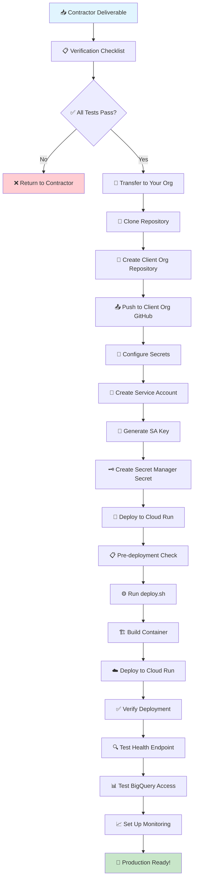

# Client Deployment Workflow - Visual Guide

## 🔄 **Complete Deployment Flow**



## 📋 **Phase-by-Phase Breakdown**

### **Phase 1: Receive & Verify** 📥
```
Contractor Repository
├── 📄 README.md (with deliverable instructions)
├── 🐳 Dockerfile (production-ready)
├── 🚀 deploy.sh (automated deployment)
├── 📦 requirements.txt (all dependencies)
├── 🧪 test_deployment.py (verification script)
├── 🔒 .dockerignore (security & optimization)
└── 💻 risk_rating_calculator.py (main application)

Verification Steps:
✅ python test_deployment.py → 5/5 PASS
✅ Code documentation complete
✅ No sensitive data committed
✅ Docker build successful
```

### **Phase 2: Transfer to Organization** 🔄
```
Contractor Org                    Your Organization
┌─────────────────┐              ┌─────────────────┐
│ contractor-repo │  ────────→   │ risk-calculator │
│ (public/private)│              │ (private)       │
└─────────────────┘              └─────────────────┘

Commands:
git clone https://github.com/contractor/repo.git
gh repo create YOUR_ORG/risk-rating-calculator --private
git remote set-url origin https://github.com/YOUR_ORG/risk-rating-calculator.git
git push -u origin main
```

### **Phase 3: Configure Production Secrets** 🔐
```
Production Environment Setup:

1. Service Account Creation
   ┌─────────────────────────────────┐
   │ risk-calculator-prod@PROJECT    │
   │ ├── BigQuery Admin              │
   │ ├── Cloud Run Admin             │
   │ ├── Secret Manager Admin        │
   │ └── Storage Admin               │
   └─────────────────────────────────┘

2. Secret Manager Configuration
   ┌─────────────────────────────────┐
   │ bellaventure_service_account_   │
   │ json                            │
   │ └── Contains: SA Key JSON       │
   └─────────────────────────────────┘
```

### **Phase 4: Automated Deployment** 🚀
```
./deploy.sh Execution Flow:

1. 🔍 Pre-flight Checks
   ├── gcloud authentication
   ├── Project configuration
   └── Secret verification

2. 🏗️ Build Process
   ├── Enable APIs
   ├── Cloud Build trigger
   └── Container creation

3. ☁️ Cloud Run Deployment
   ├── Service configuration
   ├── Environment variables
   ├── Scaling parameters
   └── Security settings

4. 📤 Output
   └── Service URL provided
```

### **Phase 5: Verification & Monitoring** ✅
```
Testing Endpoints:
┌─────────────────────────────────────┐
│ GET  /health  → {"status":"healthy"}│
│ POST /process → Triggers calculation│
└─────────────────────────────────────┘

Monitoring Setup:
┌─────────────────────────────────────┐
│ Cloud Run Metrics                   │
│ ├── Request count                   │
│ ├── Response time                   │
│ ├── Error rate                      │
│ └── Resource utilization            │
│                                     │
│ BigQuery Integration                │
│ ├── Query success rate             │
│ ├── Data access logs               │
│ └── Cost monitoring                 │
└─────────────────────────────────────┘
```

## ⏱️ **Timeline Expectations**

| Phase | Duration | Complexity | Dependencies |
|-------|----------|------------|--------------|
| **Receive & Verify** | 15 minutes | Low | Contractor completion |
| **Transfer to Org** | 10 minutes | Low | GitHub access |
| **Configure Secrets** | 20 minutes | Medium | GCP permissions |
| **Deploy to Cloud Run** | 15 minutes | Low | Automated script |
| **Verify & Monitor** | 30 minutes | Medium | Testing & setup |
| **Total** | **~90 minutes** | | |

## 🔧 **Quick Reference Commands**

### **Essential Commands Checklist**
```bash
# Phase 2: Transfer
git clone CONTRACTOR_REPO
gh repo create YOUR_ORG/risk-calculator --private
git remote set-url origin YOUR_ORG_URL
git push -u origin main

# Phase 3: Secrets
export GOOGLE_CLOUD_PROJECT=YOUR_PROD_PROJECT
gcloud secrets create bellaventure_service_account_json --data-file=key.json

# Phase 4: Deploy
./deploy.sh

# Phase 5: Verify
curl SERVICE_URL/health
curl -X POST SERVICE_URL/process
```

### **Troubleshooting Quick Fixes**
```bash
# Secret issues
gcloud secrets list --project=$GOOGLE_CLOUD_PROJECT

# Permission issues  
gcloud projects get-iam-policy $GOOGLE_CLOUD_PROJECT

# Container issues
gcloud logs read "resource.type=cloud_run_revision" --limit=10

# BigQuery issues
bq ls $GOOGLE_CLOUD_PROJECT:warehouse
```

## 🎯 **Success Criteria**

### **Deployment Successful When:**
- ✅ Health endpoint returns `{"status": "healthy"}`
- ✅ Processing endpoint accepts POST requests
- ✅ BigQuery queries execute successfully
- ✅ No error logs in Cloud Run
- ✅ Secret Manager integration working
- ✅ Service scales automatically under load

### **Ready for Production When:**
- ✅ All verification tests pass
- ✅ Monitoring and alerting configured
- ✅ Cost optimization settings applied
- ✅ Security audit completed
- ✅ Documentation updated
- ✅ Team trained on operations

---

**🚀 Result**: A fully operational, production-ready risk rating calculator service deployed to Google Cloud Run with enterprise-grade security, monitoring, and scalability. 